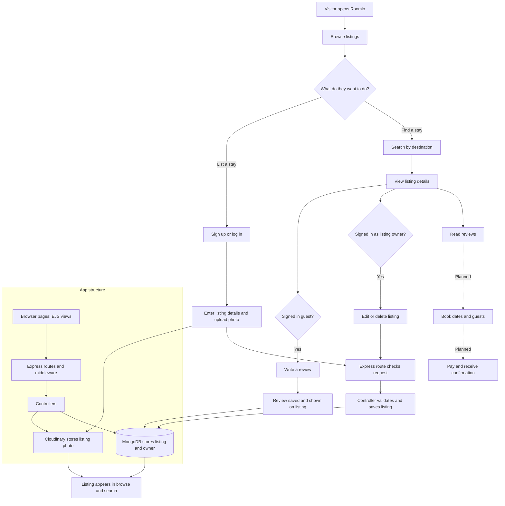

# Roomlo work flow

This diagram shows the main user flow and where each part of the app handles the request. The dashed booking path is a planned feature; bookings and payments are not implemented yet.

## In one sentence

People browse/search stays, hosts sign in and publish listings with photos, and guests can review listings; booking and payment are future work.
